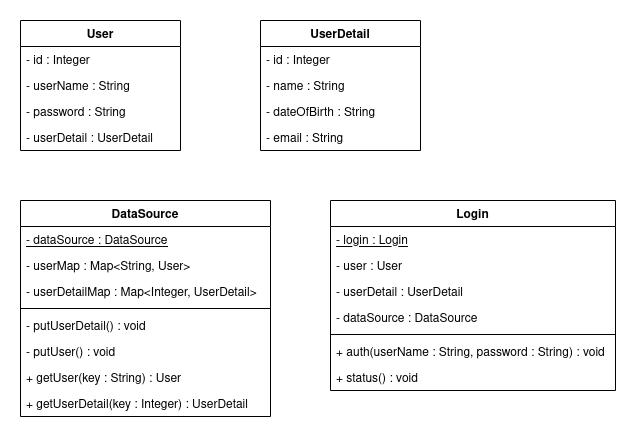

# Simple Login System

<p align="center">

</p>

# Berdasarkan Class Diagram Diatas
Buatlah sebuah program sistem autentikasi sederhana yang menerima input berupa username dan password, kemudian program akan menampilkan detail user jika inputan valid dan menghasilkan `NoSuchElementException` jika Tidak.   
Inputan dikatakan valid jika username dan password sesuai dan terdapat didalam database.  
Database berupa file `.txt` dengan format sebagai berikut
```
// file User.txt
1;fitrh;12345678
2;arzk;qwerty
3;ken;asdf
4;naim;Naim
5;farhan;Parhan
```
```
// file UserDetail.txt
1;Muhammad Fitrah;04-09-1998;fitrahm17h@student.unhas.ac.id
2;Muhammad Arizki;00-00-0000;arizkim17h@student.unhas.ac.id
3;Kennedy;00-02-2000;kennedy17h@student.unhas.ac.id
4;Muhammad Muflihun Naim;00-00-0000;naimmm17h@student.unhas.ac.id
5;Farhan Ramdhani;00-00-0000;ramdhanif17h@student.unhas.ac.id
```
`User.txt` digunakan sebagai database untuk membuat objek dari `class User` dengan format
```
id;username;password
```
Sedangkan file `UserDetail.txt` merupakan database untuk membuat objek dari `class UserDetail` dengan format
```
id;name;dateOfBirth;email
```
`Class DataSource` merupakan `class` yang bertanggung jawab dalam hal menangani data dari database.  
Method `putUser()` dan `putUserDetail()` adalah method `private` yang berfungsi untuk membaca data dari file `.txt` kemudian menjadikannya `HashMap`.  
`Class Login` merupakan class yang nantinya akan diinstansiasi pada `main` method.  
`Class DataSource` dan `Class Login` merupakan class dengan `Constructor` yang memiliki akases modifier `private`.

Berikut contoh `main` method dan outputnya ketika method `status()` dari class `Login` di panggil :

Contoh Inputan Valid :
```java
public class App {
    public static void main(String[] args) throws Exception {
        // Instansiasi class Login
        login.auth("naim", "Naim");
        login.status();
    }
}
```
Output :
```sh
Name            : Muhammad Muflihun Naim
Email           : naimmm17h@student.unhas.ac.id
Date of Birth   : 00-00-0000
User Name       : naim
Password        : Naim
```
Contoh Inputan Username tidak valid
```java
public class App {
    public static void main(String[] args) throws Exception {
        // Instansiasi class Login
        login.auth("Farha", "parhan");
        login.status();
    }
}
```
Output :
```sh
Exception in thread "main" java.util.NoSuchElementException: No such Username : Farha
```

Class Diagram yang lebih jelas dapat diunduh disini : [Class Diagram.pdf](assets/login_system.pdf).