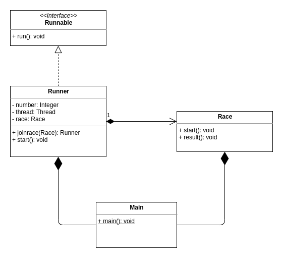
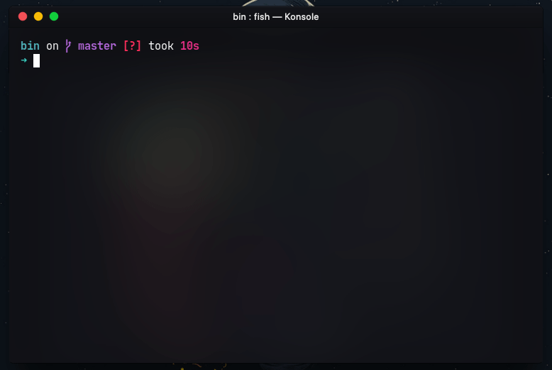
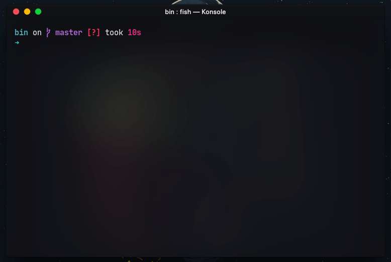

# Race Run
<p align="center">
  
</p>

Berdasarkan kelas diagram diatas, buatlah sebuah program yang mensimulasikan perlombaan lari.  
Didalam perlombaan ini, terdapat 3 pemenang, yaitu juara 1, 2, dan 3, sehingga membutuhkan minimal 3 peserta.  
Jika juara 1, 2, dan 3 telah ditentukan, maka peserta lainnya dinyatakan kalah.  
Juara 1, 2, dan 3 tidak mungkin peserta yang sama.  
Juara 1, 2, dan 3 tidak mungkin berada pada daftar peserta yang kalah begitupula sebaliknya.  

## Berikut Penjelasan dari Class Diagram diatas

- `Runner::joinRace(Race race)` adalah method yang digunakan oleh `class Runner` untuk mengikuti sebuah pertandingan.
  - Setiap `Runner` yang mengikuti sebuah `Race` akan mengakibatkan durasi `Race` bertambah 1 detik.
- `Runner::start()` adalah method yang digunakan oleh `class Runner` untuk mulai berlari (menjalankan method `run()` dari `interface Runnable`).
  - Jika `Runner` belum mengikuti `Race`, maka akan muncul pesan "`Runner-%d have not entered any race`", dimana `%d` adalah nomor `Runner`.
  - Jika `Runner` telah mengikuti `Race`, namun `Race` yang diikuiti belum dimulai, maka akan muncul pesan "`Hey Runner-%d, the race hasn't started yet`".
  - Jika salah satu pesan diatas muncul, berarti `Runner` yang dimaksud tidak mengikuti `Race`.
- `Race::start()` adalah method yang digunakan oleh `class Race` untuk menandakan bahwa perlombaan telah dimulai.
  - Jika method `start` dipanggil, maka akan muncul pesan "`The race starts . . .`".
  - Jika method `start` dipanggil, namun jumlah peserta belum mencukupi, maka akan mucul pesan "`The race cannot be started, runners are not enough`" dan perlombaan tidak dimulai.
- `Race::result()` adalah method yang digunakan oleh `class Race` untuk menampilkan hasi pertandingan.
  - method ini harus dipastikan terpanggil setelah perlombaan selesai.
  - Jika method ini berhasil dipanggil, maka akan muncul pesan "`The race is over.`" diikuti dengan daftar pemenang dan peserta yang kalah.
- Atribut dari `class Race` silahkan anda tentukan sendiri.
- Atribut pada `class Runner` dan `Race` dapat anda tambahkan sesuai kebutuhan.
- Method pada `class Runner` dan `Race` dapat anda tambahkan sesuai kebutuhan.

## Contoh main method

```java
public static void main(String[] args) {
    Integer number = 0;
    Race race = new Race();
    Runner[] runners = new Runner[10];

    for (int i = 0; i < runners.length; i++) {
      runners[i] = new Runner(++number);
      runners[i].joinRace(race);
    }

    race.start();

    for (Runner runner : runners) {
      runner.start();
    }

    race.result();
  }
```

## Contoh Output

<p align="center">
  <figurer>
    
    <figcaption>
     <p align="center">Output Normal, terdapat jeda 10 detik sebelum selesai</p>
     <p align="center">Jeda tersebut ditentukan oleh banyaknya peserta</p>
     </figcaption>
  </figurer>
</p>

<p align="center">
  <figurer>
    
    <figcaption>
     <p align="center">Output jika method start dari class Runner dipanggil namun method start dari class Race belum dipanggil</p>
     <p align="center">Tidak ada jeda, program langsung selsesai</p>
     </figcaption>
  </figurer>
</p>